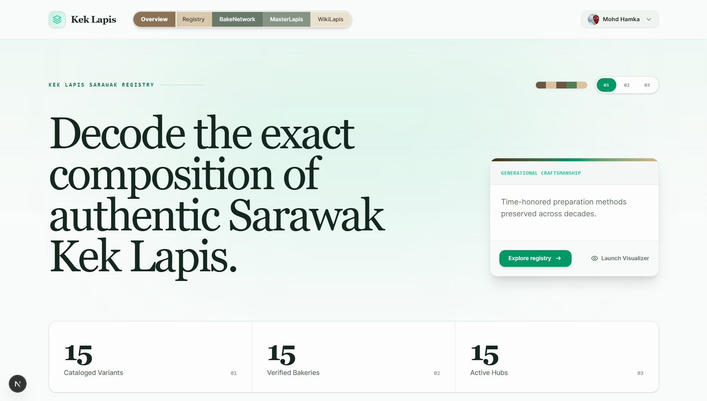

# Kek Lapis

> Sarawak's definitive traditional and modern Kek Lapis registry, bakery directory, and heritage archive.

[Live Demo](https://keklapis.vercel.app/) · [Quick Start](./docs/quick-start.md) · [Architecture](./docs/architecture.md) · [Report Bug](https://github.com/mhdhamka/keklapis/issues) · [Request Feature](https://github.com/mhdhamka/keklapis/issues)

---

## Overview

**Kek Lapis** transforms the traditional web registry into an immersive digital archive for Sarawak’s layered cakes. Designed with a high-contrast editorial heritage aesthetic, it brings together verified bakeries, authentic recipes, geographical origins through an interactive map, and detailed baking standards and heritage certifications all within a living, interactive experience.

---

## Preview

*Kek Lapis landing page with editorial typography, navigation palette layers, and language selection*

---

## Key Features

* **Signature Color Palette Engine:** 5-color aesthetic border accents matching traditional Kek Lapis visual standards (`#7A5C3E`, `#B3936A`, `#2E4A35`, `#5B6E53`, `#D4C4A8`).
* **Smart Bakery & Variant Filters:** Instant search and category toggles to surface traditional or modern variants.
* **Registry Modal Inspector:**
  * **Recipe Records:** Live ingredient and specification details embedded in the UI.
  * **Heritage Verification:** Automated breakdown of KKM approvals, halal certification, and master house status.
  * **Bakery Location Map:** Visual geographic mapping of regional bakeries across Sarawak.
* **AI Heritage Copilot:** Interactive slide-over assistant powered by Google Gemini via `@google/genai` to answer recipe questions, explore baking techniques, and guide users through regional traditions in real time.
* **Editorial Preloader:** Smooth transitions styled for archival exploration.

---

If you found this project interesting, consider giving it a star!

   
  <b>Developed & Maintained by <a href="https://github.com/mhdhamka">mdhamka</a></b>

